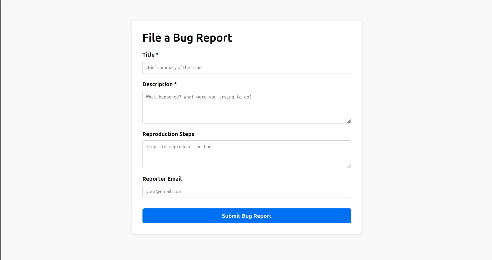

# Deployed URL
https://group-project-bug-tracker-front-end-group-8-160c445v0.vercel.app/

# AI Workflows

## Christina
My first prompt was "Create a Next.js app with a single public form that posts to POST /issues. 
Read openapi.yaml and sprint-5.md to understand the backend API and what features are requested."
It produced a Next.js app that rendered properly when I tested locally:

Error messages were user-friendly as specified in this sprint's user stories. However, the
model assumed I was running the backend API locally, so the server connection was failing.
To solve this, I pointed the agent to our team's backend web service, and it updated `app/page.js`
to point to the deployed API. The connection was still failing, so I re-prompted to try to find
a better solution. The agent rewrote `next.config.js` to proxy requests from the local dev server
to the Render API to solve CORS issues, then updated the `fetch` URL in `app/page.js` to use the
rewrite. This solved the server issues.
Finally, I prompted it to create a `.gitignore` file for the project, and create tests, located within
`test/page.test.js`. It took a few iterations of prompting to solve issues with failing tests related 
to `TestingLibraryElementError` errors.
Once everything worked locally, I prompted the agent with the "As a frontend developer, I want the 
form to talk to our deployed API (not localhost) so that the deployed FE actually works end-to-end" 
user story to ensure the app will work if we decide to deploy this implementation with Vercel. 
