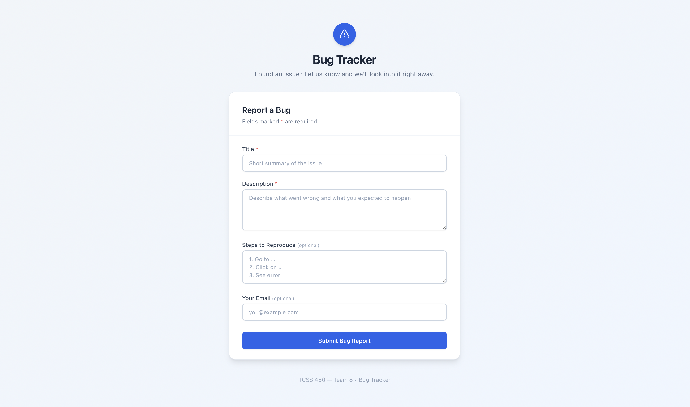
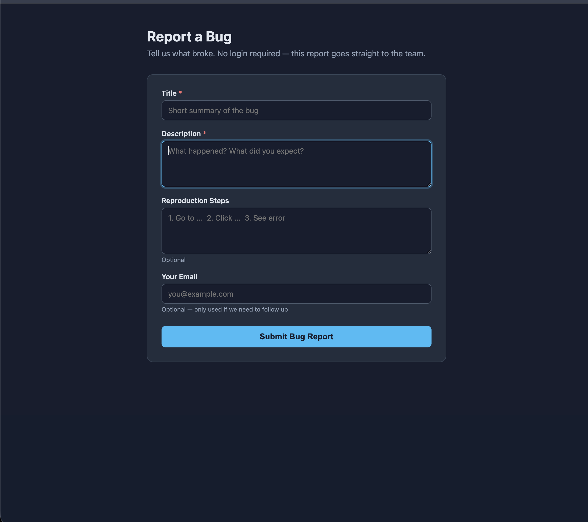

# Deployed URL
https://group-project-bug-tracker-front-end-mu.vercel.app/

# AI Workflows

## Christina
To start with I added the OpenAPI docs to my branch off this repository, along with a `sprint-5.md` file containing the user stories the agent needed to understand the requirements of this sprint. 
I used the Gemini Code Assist plugin available on WebStorm. 
My first prompt was "Create a Next.js app with a single public form that posts to POST /issues. 
Read openapi.yaml and sprint-5.md to understand the backend API and what features are requested."
It produced a Next.js app that rendered properly when I tested locally:

Error messages were user-friendly as specified in this sprint's user stories. However, the
model assumed I was running the backend API locally, so the server connection was failing.
To solve this, I pointed the agent to our team's backend web service, and it updated `app/page.js`
to point to the deployed API. The connection was still failing, so I re-prompted to try to find
a better solution. The agent rewrote `next.config.js` to proxy requests from the local dev server
to the Render API to solve CORS issues, then updated the `fetch` URL in `app/page.js` to use the
rewrite. This solved the server issues.
Finally, I prompted it to create a `.gitignore` file for the project, and create tests, located within
`test/page.test.js`. It took a few iterations of prompting to solve issues with failing tests related 
to `TestingLibraryElementError` errors.
Once everything worked locally, I prompted the agent with the "As a frontend developer, I want the 
form to talk to our deployed API (not localhost) so that the deployed FE actually works end-to-end" 
user story to ensure the app will work if we decide to deploy this implementation with Vercel. 

## Charlene

I started by setting up my context. In an empty directory in github I added a sprint-5.md, the openapi.yaml and schema.prisma from our backend, and a README.md. The sprint-5.md was text copied and pasted from the sprint-5 instructions, but trimmed down to necessary information only. In the README.md, I put the backend URL and an example of our POST /issues request body.

Once the context was setup, I directed Claude Code Web to this directory and gave it the following prompt: "Read these files. Build the Bug Tracker FE described in the sprint-5.md document against the API in the spec. The backend-openapi.yaml and backend-schema.prisma files are from our team's backend API that has the issues routes."

I was satisfied with the bug tracker Claude first produced as long as it functioned properly. After testing network-error, validation-error, and success cases, I was completely satisfied with this form. It looks clean, the messages are clear, and it functions as intended. I especially like how the respective required field is outlined red when the user tries to submit a form without it. The only other prompts I made were to get help setting up the CORS, so I could test the form.

If I did this over again, I don't know if I would have bothered with Claude Code. There was a lot of difficulty connecting it to github with the proper authentication and I only had four context files that would have been easy to copy-paste into the Claude browser. However, it was nice that whole frontend was setup for me and all I had to do was pull it from github onto my local machine. Without any Next.js experience, this may have been challenging to setup on my own. 

## Mansur
### Context I prepared before prompting

I started in a clean working directory on `mansurBranchFE`. Before I typed
a single prompt I made sure the agent could find:

* `sprint-5.md`, the sprint spec
* `openapi.yaml`, our team's API contract, so the agent could see the exact
  `IssueInput` shape for `POST /v1/issues`
* a note in the README pointing at our deployed BE on Render

I wanted to see how little prompting I could get away with if the context
was solid. That mindset paid off. My prompts stayed short.

### First prompt

> Read `sprint-5.md` and `openapi.yaml`. Build a Next.js (App Router) app
> with a single public form that posts to `POST /v1/issues`. Keep it simple.

The first cut included `package.json`, `next.config.js`, `app/layout.js`,
and `app/page.js`. The form already had the four correct fields from
`IssueInput` with the right required and optional split, and the length
caps came straight from the spec. That part was solid out of the gate.

What it got wrong: the API base was hard coded to `http://localhost:3000`,
every failure showed the same generic message, and the markup leaned on
inline styles that looked like 2012 instead of 2026. Nothing fatal, just
not done.

### Second prompt, fix the API URL handling

> Don't hard code the API URL. Read it from `NEXT_PUBLIC_API_URL` at build
> time, strip a trailing slash if present, and surface a clear error if it's
> missing.

The agent moved the base into `process.env.NEXT_PUBLIC_API_URL`, normalized
the trailing slash, and added an early return if the variable was missing.
I added `.env.local` and `.env.local.example` myself so anyone cloning the
repo would not have to guess the variable name.

### Third prompt, split the three error states

> Per the sprint, success, validation failure, and network failure each
> need distinct UI. On 201 show a confirmation with the returned issue id
> and clear the form. On 400 map the API's `error` string to the most likely
> field and show it inline. On network failure keep what the user typed and
> show a calm banner.

This produced the `mapServerError` helper and the split between
`submittedId` and `globalError` state. I kept this almost as is. The only
thing I added on my own was moving focus to the success banner with a ref,
so screen readers announce it. That covers the accessibility user story.

### Fourth round, the CORS surprise

After I deployed to Vercel the page loaded fine but real form submissions
were going to fail because the BE on Render doesn't have the Vercel origin
in its CORS allowlist, and I don't have Render access. Rather than chase
that I prompted the agent to add a Next.js rewrite that proxies
`/api/:path*` to `${NEXT_PUBLIC_API_URL}/v1/:path*` and updated the fetch
to hit `/api/issues`. Same origin in the browser, no preflight failures,
problem gone. I verified it end to end with curl against the deployed URL
and the BE filed real issues (`#29` and `#30` in our database).

### What I kept

* The reusable `Field` component the agent generated, which wires up the
  label, input or textarea, error text, and `aria-describedby` cleanly.
* The keyword based mapping from a 400 `error` string back to the
  responsible field.
* The `NEXT_PUBLIC_API_URL` driven base and the rewrite trick to dodge CORS.

### What I cut or rewrote

* Inline styles. I moved everything to `globals.css` with a small dark
  themed look so the form actually felt like it belonged in 2026.
* Tests. The agent reached for Jest and React Testing Library on its own.
  The sprint does not require them and they bloated the dependency tree.
  Christina's branch already has a tested version, so if the team picks a
  composite those can come along then.
* A long over engineered error tree. I simplified it down to "did the
  server reply with a known field name in the error string, yes or no."

### What I would prompt differently next time

* I would hand the agent a one page "non goals" file alongside `sprint-5.md`
  saying things like "no auth, no admin views, no Tailwind, no test
  framework, no TypeScript." It kept reaching for those on its own and I
  burned prompts redirecting it.
* I would ask for the three error states and the accessibility hooks in
  the very first prompt instead of bolting them on later. When asked the
  agent did them well. Left to its own defaults it did not bother.
* I would mention the deployment topology up front: BE on Render, FE on
  Vercel, you do not own the BE CORS list. If I had said that on day one
  the agent would have reached for the rewrite immediately instead of me
  finding the broken preflight after deploy.
